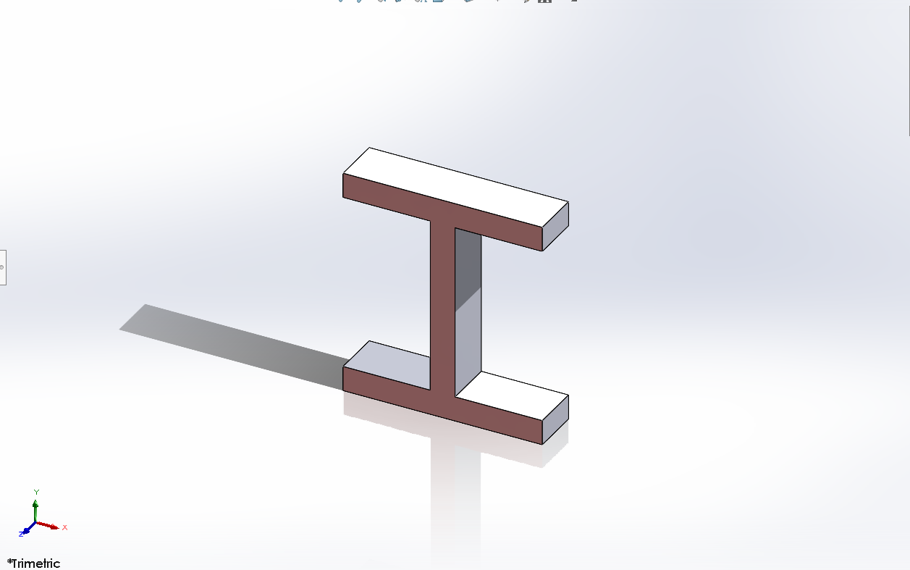
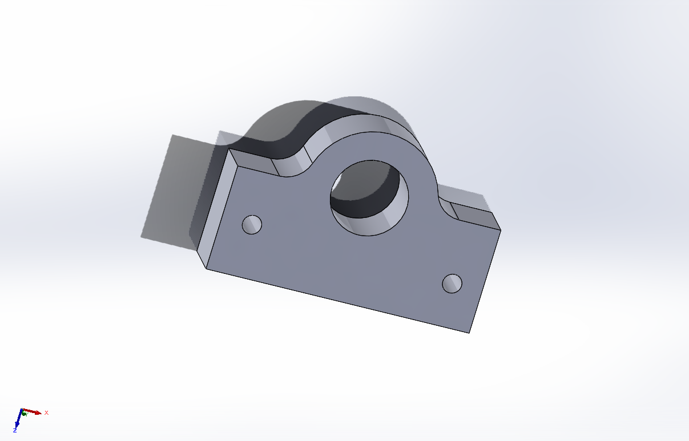
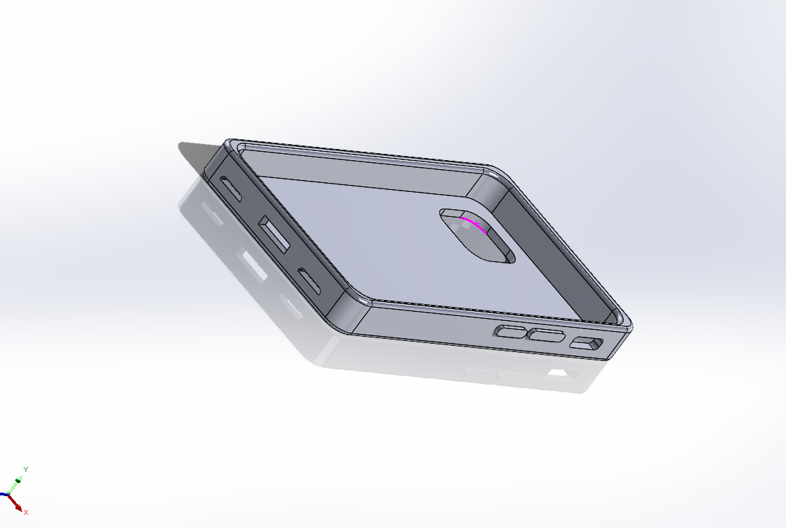
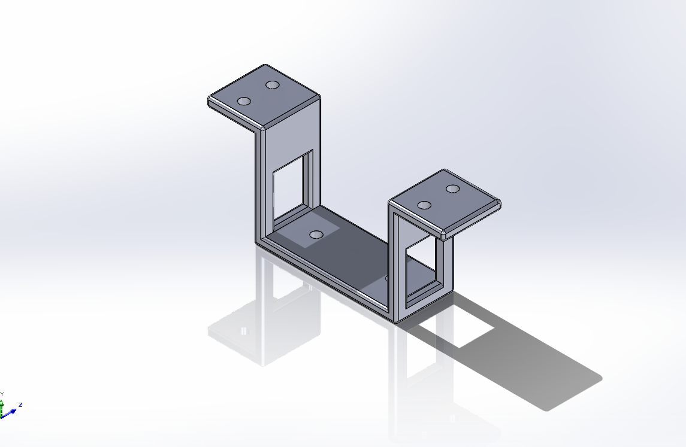
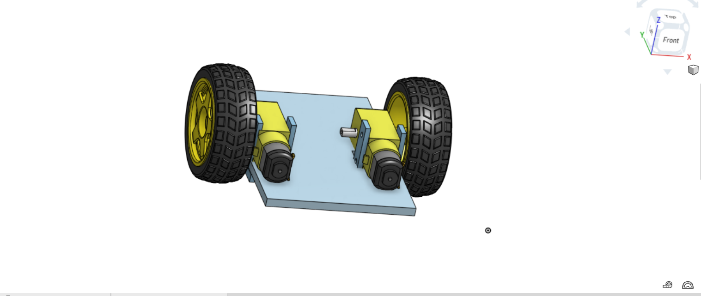
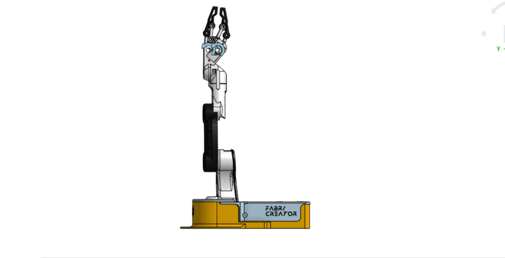
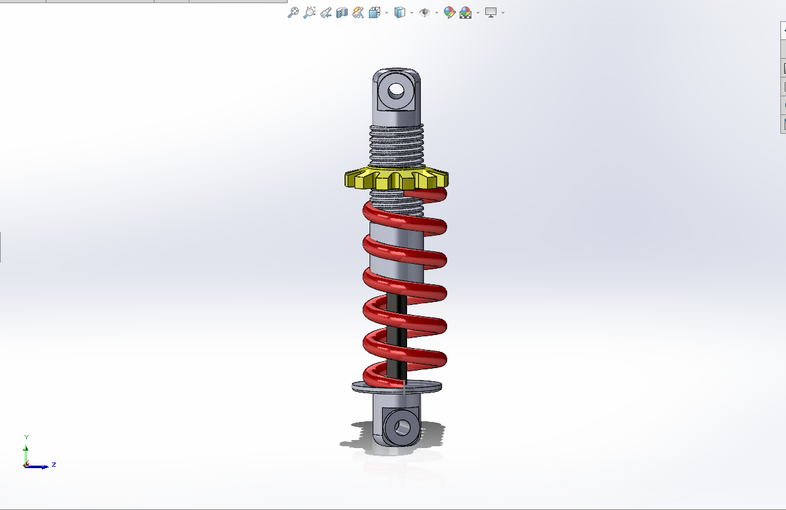
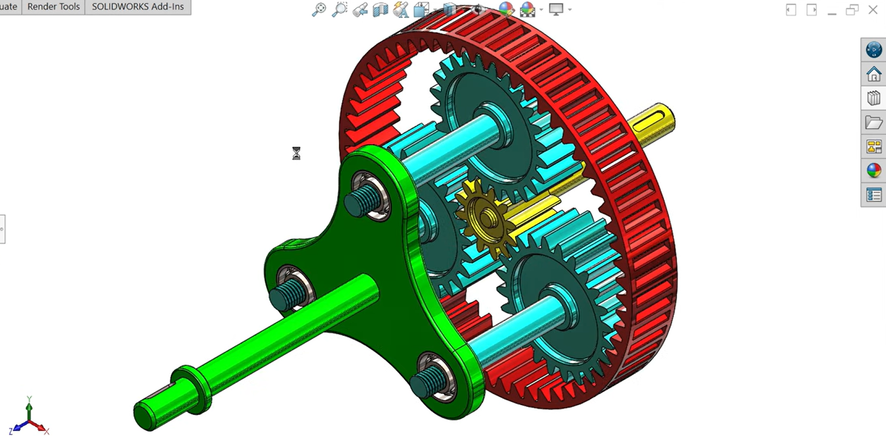

# All-tasks
All mechanical tasks

## Image 1

Description: Designing the letter (H) in solidworks.

---

## Image 2

Description: Design of a mechanical part.

---

## Image 3

Description: Mobile phone case design.

---

## Image 4

Description: a base TT Motor.

---

## Image 5

Description: design Chassis and assembly.

---

## Image 6

Description: Assembling robot arm parts.

---

## Image 7

Description: Suspension system design and assembly.

---

## Image 8

Description: Design and assembly of a gearbox SOLIDWORKS.
